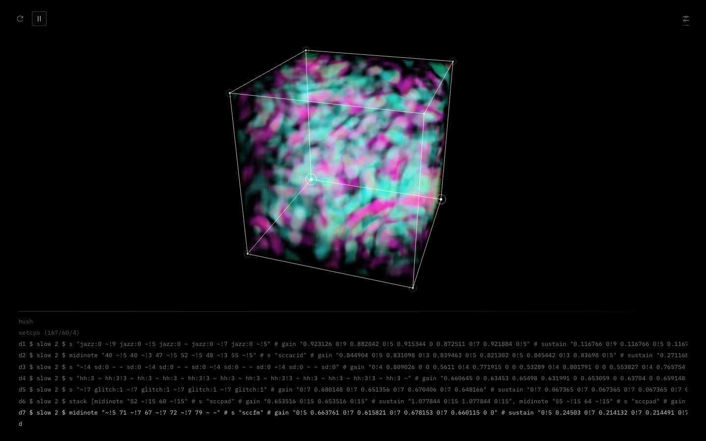
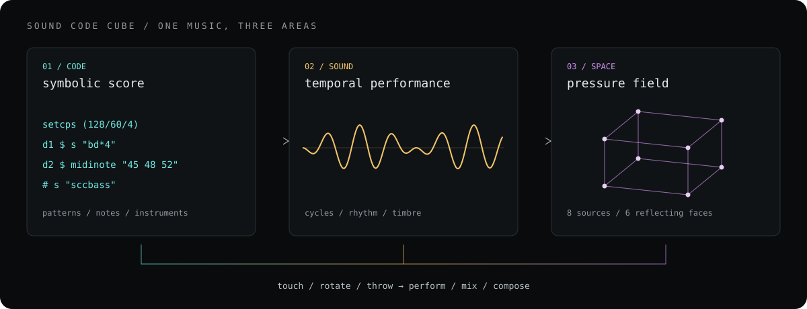
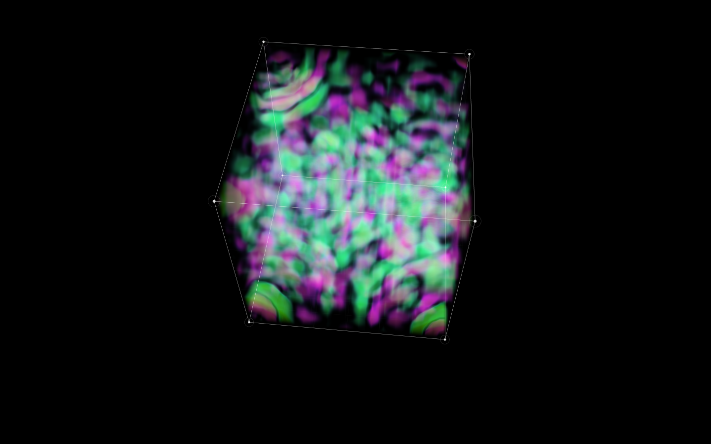
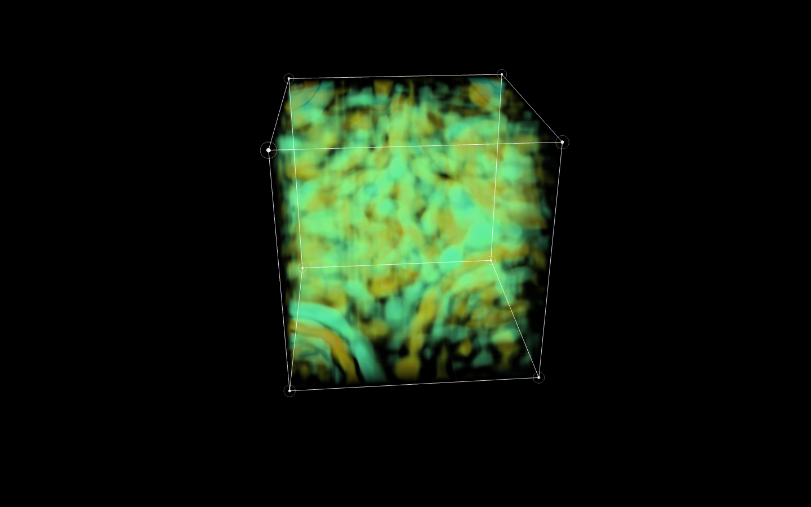
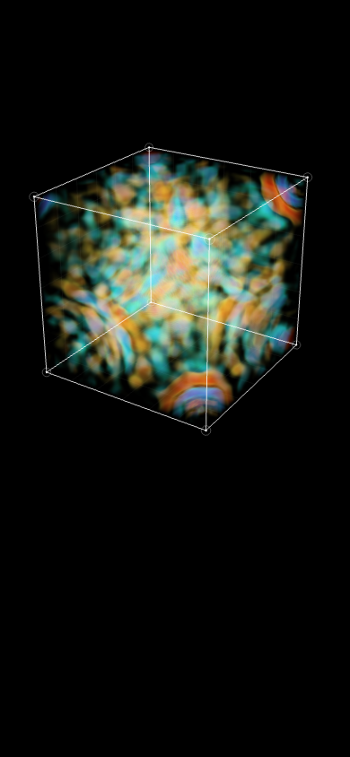
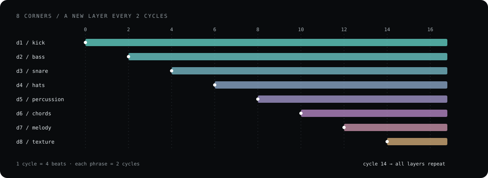

# Sound Code Cube

**One music, three areas — code · sound · space**

소리의 시간을 공간으로 읽고, 그 공간을 다시 연주하는 악기.

Codex가 구성한 여덟 성부의 음악을 **코드, 소리, 공간이라는 세 영역(area)**에 매핑합니다. TidalCycles 악보는 화면 아래에서 타이핑되고, 음악은 두 사이클마다 한 겹씩 쌓이며, 여덟 꼭짓점에서 시작한 파동은 큐브 안에서 반사되고 겹쳐집니다. 꼭짓점을 두드리거나 큐브를 흔들어 던지면서 이 과정에 개입할 수 있습니다.



> **Codex CLI가 설치되어 있고 본인의 ChatGPT 계정으로 OAuth 로그인한 컴퓨터에서만 작동합니다.** 각 사용자는 자신의 로컬 Codex와 계정을 사용합니다. 웹사이트만 열어 실행하는 서비스가 아니라, 내려받아 로컬에서 실행하는 앱입니다.

[설치 및 실행](#설치-및-실행) · [조작](#조작) · [세 개의 area](#하나의-음악-세-개의-area) · [물리](#호이겐스에서-압력장으로) · [TidalCycles 예시](#tidalcycles-예시) · [최신 릴리스](https://github.com/TaewoooPark/Sound-Code-Cube/releases/latest)

## 하나의 음악, 세 개의 area



| Area | 음악이 존재하는 형태 | 경험하는 방식 |
| --- | --- | --- |
| **Code — 기호의 영역** | 음표, 리듬, 악기, 반복을 기술하는 TidalCycles 악보 | 소리를 만드는 규칙을 읽습니다. 생성된 코드는 레이어 진입에 맞춰 타이핑됩니다. |
| **Sound — 시간의 영역** | 박자에 따라 발생하고 사라지는 소리, 여덟 성부의 반복 | 음악을 듣고, 꼭짓점을 눌러 타격을 더하며, 전환의 시점을 정합니다. |
| **Space — 공간의 영역** | 각 성부에서 출발해 전파·반사·간섭하는 상대 압력장 | 소리가 공간을 함께 점유하는 관계를 색, 밀도, 깊이로 바라봅니다. |

세 영역은 같은 악보를 서로 다른 방식으로 드러냅니다. 코드는 앞으로 발생할 사건의 규칙이고, 소리는 그 규칙이 수행되는 시간이며, 공간은 그 사건들이 퍼지고 겹치는 관계입니다. 관객의 몸짓은 이 세 형태를 다시 연결합니다.

여덟 성부가 모이면 음악은 반복되며 머무를 수 있는 상태를 만듭니다. 이 작업에서 완성은 그 상태에 도달하는 일이며, 다음 몸짓은 새로운 구성을 여는 일이 됩니다.

## 빛에서 시작한 질문

이 작업은 Diego Royo 등의 **《mitransient: Transient light transport in Mitsuba 3》**를 본 경험에서 시작했습니다. 이 연구는 빛의 비행시간을 렌더링에 포함하여 시간에 따른 빛의 전파를 시뮬레이션합니다. 여기서 가져온 질문은 단순했습니다. **빛이 공간을 통과하는 과정을 볼 수 있다면, 소리 역시 3차원에 매핑함으로써 새로운 의미를 가질 수 있지 않을까?** [논문, 2025](https://arxiv.org/abs/2510.25660)

이 질문을 소리에 적용하면서 호이겐스 원리를 전파의 출발점으로 삼았습니다. 정육면체의 **여덟 꼭짓점을 여덟 성부의 파원**으로, **여섯 면을 반사의 경계**로 잡았습니다. 내부는 여러 소리가 동시에 존재하는 공간이 됩니다. mitransient의 구현이나 빛의 수송 방정식을 포팅한 프로젝트는 아니며, 시간에 따른 물리적 현상을 보이게 한다는 발상을 소리로 확장한 작업입니다.

## 큐브의 여러 상태

<table>
  <tr>
    <td width="50%"><br/><strong>압력의 부피</strong><br/>연속적인 색과 투명도로 압축·희박 영역의 깊이를 드러냅니다.</td>
    <td width="50%"><br/><strong>다음 장르로의 전환</strong><br/>두 곡이 겹치는 동안 색조와 전환 파면도 함께 바뀝니다.</td>
  </tr>
  <tr>
    <td width="50%"><br/><strong>선택한 색으로 읽기</strong><br/>컬러맵, 사용할 색 구간, 진폭 감도를 조정합니다.</td>
    <td width="50%" align="center"><br/><strong>작은 화면의 공간</strong><br/>좁은 뷰포트에서도 회전과 볼륨 렌더링을 유지합니다.</td>
  </tr>
</table>

첫 이미지는 실제 앱의 재생 화면입니다. 위 갤러리는 같은 Three.js 파동 렌더러를 여러 입력·팔레트·뷰포트에서 캡처한 검증 장면입니다. 모바일 이미지는 반응형 렌더링 예시이며, 휴대폰에서 Codex 없이 독립적으로 실행된다는 뜻은 아닙니다. 이미지 출처와 원본 SVG는 [갤러리 노트](docs/gallery.md)에 정리했습니다.

## 설치 및 실행

### 준비

- **Node.js 22.12 이상**과 npm. CI에서는 Node.js 22·24를 확인합니다.
- **로컬 Codex CLI**와 **본인 ChatGPT 계정의 OAuth 로그인**. `npm run doctor`로 탐지 결과를 확인합니다. 지원하는 데스크톱 앱의 내장 CLI도 탐색하며, 터미널에서 직접 사용하려면 PATH에 CLI를 설치하는 것을 권장합니다. [공식 Codex CLI 안내](https://developers.openai.com/codex/cli/)
- WebGL 2와 Web Audio를 지원하는 최신 브라우저. 최초 재생은 재생 버튼으로 시작합니다.
- Codex 작곡을 위한 인터넷 연결 및 자신의 계정에서 사용 가능한 Codex 권한·사용량.

macOS에서 전체 네이티브 경로를 검증했습니다. Linux·WSL에서는 Node.js와 Codex CLI가 실행되는 환경에서 브라우저 오디오 경로를 사용할 수 있습니다. 네이티브 오디오의 자동 설치는 macOS/Homebrew 기준이며, 다른 운영체제는 TidalCycles와 SuperCollider를 직접 준비해야 합니다.

### 빠른 시작 — 로컬 브라우저 오디오

Codex가 설치되어 있지 않다면 먼저 공식 CLI를 설치합니다.

```sh
npm install -g @openai/codex
```

이후 저장소를 내려받고 자신의 로그인 상태를 확인합니다.

```sh
git clone https://github.com/TaewoooPark/Sound-Code-Cube.git
cd Sound-Code-Cube
npm ci

# Codex 실행 파일, 필요한 CLI 기능, 본인 ChatGPT 로그인 확인
npm run doctor

# 로그인이 필요한 경우에만 실행
npm run login

# 드럼 샘플을 원본 저장소에서 별도 다운로드
npm run setup:samples

npm run build
npm start
```

**[http://127.0.0.1:4318](http://127.0.0.1:4318)**을 열고 좌측 상단 재생 버튼을 누릅니다. `npm start`는 로컬 API와 빌드된 화면을 함께 제공합니다. Codex가 없거나 ChatGPT OAuth 로그인이 확인되지 않으면 실행을 멈추고 터미널에 해결 방법을 안내합니다. `npm run login`은 설치된 Codex CLI의 로그인 절차를 실행합니다. 이미 본인 계정으로 로그인했다면 다시 로그인할 필요가 없습니다.

이 경로는 **Codex가 만든 같은 악보를 Web Audio로 연주**합니다. 드럼은 내려받은 Dirt-Samples를 사용하고, 멜로디는 브라우저 신스로 합성합니다. Tidal Haskell 자체를 브라우저에서 실행하는 것은 아닙니다.

### 전체 실행 — 실제 TidalCycles + SuperDirt

```sh
npm run setup:native
npm run build
npm run start:native
```

**[http://127.0.0.1:4318](http://127.0.0.1:4318)**을 엽니다. TidalCycles의 시계가 악보를 실행하고 SuperDirt·SuperCollider가 실제 소리를 출력합니다. 브라우저에서는 같은 악보의 분석 신호로 시각화를 구동합니다.

`setup:native`는 macOS의 Homebrew를 이용해 GHC, Cabal, libffi, SuperCollider를 준비하고 프로젝트의 `.runtime/`에 Tidal 패키지 환경과 SuperDirt, Vowel, Dirt-Samples를 설치합니다. 최초 다운로드·컴파일에는 시간이 걸립니다. 설치된 도구와 샘플은 다음 실행에서 재사용합니다. 수동 환경변수와 실행 구조는 [로컬 런타임 안내](docs/runtime.md), API는 [서버 문서](server/README.md)를 참고하세요.

### 배포 형태와 계정

공개 배포는 [GitHub 소스 릴리스](https://github.com/TaewoooPark/Sound-Code-Cube/releases)입니다. 저장소를 복제하거나 릴리스의 소스를 받아 **각자의 컴퓨터에서** 실행합니다. 다른 사용자의 계정이나 서버를 빌리는 구조가 아닙니다.

앱은 로컬 Codex CLI를 탐지하고 로그인 상태를 확인한 뒤 해당 CLI로 작곡을 요청합니다. OAuth 토큰을 브라우저에 전달하거나 앱의 설정 파일에 복사하지 않습니다. 브라우저에 API 키를 붙여 넣는 절차도 없습니다. 요청은 각자 로그인한 계정으로 실행되므로 사용량도 해당 계정에 반영됩니다. 인증이 필요한 절차는 [Codex 공식 인증 문서](https://developers.openai.com/codex/auth/)를 따릅니다.

## 조작

| 위치 / 동작 | 결과 |
| --- | --- |
| 좌측 상단 **재생 / 정지**, 또는 **Space** | 명시적으로 재생을 시작하거나 멈춥니다. 준비 중에도 정지가 가능합니다. |
| 좌측 상단 **새로고침** | 직전과 다른 장르를 선택하고 대기합니다. 다시 재생을 누르면 새 곡을 만듭니다. |
| 큐브 **드래그 / 터치** | 공간을 회전해 다른 방향에서 봅니다. |
| 재생 중 **꼭짓점 클릭 / 탭** | 해당 성부의 음을 추가합니다. 세 번 빠르게 누르면 세 번의 타격이 차례로 발생합니다. |
| 재생 중 **지그재그로 흔든 뒤 빠르게 던지기** | 다음 장르로 6–12초간 크로스페이드합니다. 일반 회전과 느린 흔들기는 전환을 만들지 않습니다. |
| 우측 상단 **컬러맵 아이콘** | 팔레트, 사용할 색 구간, 진폭 감도를 바꿉니다. 설정은 브라우저에 저장됩니다. |
| 하단 **코드 영역** | 실제 생성된 TidalCycles 악보가 타이핑됩니다. 긴 행은 가로 스크롤할 수 있습니다. |

**정지는 작곡 요청, 다음 곡 준비, 예약음, 연타 대기열, 믹싱을 함께 취소합니다.** 늦게 도착한 응답으로 자동 재생을 다시 시작하지 않습니다. 이미 완성된 현재 악보는 다음 재생 시 멈춘 위치에서 이어갑니다. 새로고침과 첫 페이지 진입은 항상 대기 상태입니다. 정지 중의 꼭짓점 클릭과 던지기도 작곡이나 재생을 시작하지 않습니다.

화면은 검은 바탕, 흰 큐브 외곽선, 흰 Tidal 코드와 컬러 압력장으로 구성했습니다. 폰트는 IBM Plex Mono입니다. 보이는 설명 문구는 넣지 않고, 버튼과 입력의 이름은 스크린리더에 제공합니다. Tab·방향키로 컬러 범위를 조절하고 Escape로 설정을 닫을 수 있습니다.

## 여덟 성부가 쌓이는 방식



한 사이클은 4박, 한 구절은 두 사이클의 32개 16분음표 위치입니다. **킥 → 베이스 → 스네어 → 하이햇 → 퍼커션 → 코드 → 멜로디 → 텍스처**가 차례로 들어오고, 여덟 성부가 모이면 계속 반복합니다.

Deep house, Techno, UK garage, Drum and bass, Trip hop, Ambient, Electro, Dub의 여덟 장르가 각기 다른 템포 범위, 리듬, 조성, 드럼 뱅크와 신스 조합을 사용합니다. 브라우저에 보관한 무작위 장르 묶음을 순서대로 소비하므로 여덟 장르를 골고루 거칩니다. 앱의 새로고침과 브라우저 새로고침 모두 직전 장르를 제외합니다.

Codex는 현재 장르와 악기 조건에 맞는 여덟 레이어를 **한 번의 구조화된 악보(JSON)로 생성**합니다. 서버가 음표·시간·악기를 검증한 뒤 Tidal 코드를 만들고, 오디오 엔진이 두 사이클 간격을 지킵니다. 모델의 응답을 매 박자 기다리지 않습니다. 재생 중에는 현재 악보를 문맥으로 다음 장르의 악보를 미리 준비합니다.

Codex가 받는 것은 **음표·리듬·조성·악기의 기호적 정보**입니다. 실제 오디오를 듣거나 마이크 입력을 분석하는 구조는 아닙니다. 화면의 타이핑은 생성된 악보를 공연 시간에 맞춰 공개하는 표현이며, 모델 내부 사고의 스트리밍이 아닙니다. 생성 실패를 로컬 악보로 조용히 대체하지 않으며, 연결 문제는 터미널과 개발 진단에서 확인할 수 있습니다.

## TidalCycles 예시

아래는 구조를 읽기 쉽도록 짧게 작성한 여덟 성부 예시입니다. 실제 Codex 결과는 음마다 gain·sustain을 따로 지정하는 더 긴 코드가 됩니다. `scc*` 악기는 프로젝트의 [SuperCollider 신스](native/synths.scd)에 정의되어 있습니다.

```haskell
setcps (128/60/4)

d1 $ s "bd:18*4"                                      # gain 0.8
d2 $ slow 2 $ midinote "45 ~ 45 48 ~ 52 48 ~" # s "sccbass"
d3 $ s "~ sn:35 ~ sn:35"                              # gain 0.65
d4 $ s "hh:3*8"                                      # gain 0.5
d5 $ s "~ perc:4 ~ ~ perc:4 ~ ~ ~"                    # pan 0.7
d6 $ slow 2 $ midinote "[57,60,64] ~ [57,60,64] ~" # s "sccpad"
d7 $ slow 2 $ midinote "69 ~ 72 ~ 76 72 ~ 67"     # s "sccbell"
d8 $ slow 2 $ midinote "81 ~"                    # s "scctexture"

-- 평가하면 모든 성부를 정지합니다.
hush
```

코드를 외부 Tidal 세션에서 평가할 때는 실행할 줄만 선택합니다. 마지막 `hush`까지 한 번에 실행하면 곧바로 멈춥니다. 위 예시는 레이어 진입을 자동 예약하지 않습니다. 앱 안에서는 네이티브 시계와 진입 게이트가 두 사이클 간격을 담당합니다.

- [짧은 라이브 코딩 예시](examples/eight-voices.tidal)
- [저장된 실제 Codex 악보 — Drum and bass / 165 BPM / A minor](examples/drum-and-bass.tidal)
- [저장된 실제 Codex 악보 — Dub / 72 BPM / D dorian](examples/dub.tidal)

## 호이겐스에서 압력장으로

호이겐스 원리는 파면의 각 점을 다음 파면을 만드는 이차 파원으로 바라봅니다. **여덟 꼭짓점을 음악의 일차 파원으로 선택한 것은 작품의 구성적 결정**입니다. 수치 구현은 이 발상을 바탕으로 감쇠가 있는 3차원 스칼라 파동방정식을 풀어 전파를 계산합니다. [호이겐스 원리 — OpenStax](https://openstax.org/books/university-physics-volume-3/pages/1-6-huygenss-principle)

$$
\frac{\partial^2 p}{\partial t^2}
+ \gamma\frac{\partial p}{\partial t}
= c^2\nabla^2p + s(\mathbf{x},t)
$$

- **전파:** 33 × 33 × 33 격자의 유한차분 계산에서 각 점의 교란이 이웃으로 전달됩니다. 시간 간격은 3차원 CFL 안정 조건을 따릅니다.
- **반사:** 여섯 경계면에 Neumann 조건을 적용해 법선 방향 압력 기울기를 0으로 둡니다.
- **간섭:** 여덟 파원이 같은 압력장에 더해집니다. 파동은 서로 통과하면서 보강·상쇄합니다. 입자처럼 서로 부딪혀 튕겨 나가는 모델은 아닙니다.
- **입력:** 성부별 분석 파형과 음표 발생 시점이 해당 꼭짓점의 교란을 만듭니다.

압력 격자는 3D 텍스처가 되고, GPU가 시선 방향으로 부피를 적분해 **반투명 히트맵**을 만듭니다. 평균 압력을 뺀 상대 압력의 부호와 크기를 색에, 크기를 밀도와 불투명도에 연결합니다. 앞에서 뒤로 투명도를 합성해 깊이를 보여 줍니다. Turbo, Plasma, Viridis, Icefire, Spectral 가운데 팔레트를 고르고 사용할 구간을 직접 제한할 수 있습니다.

공간과 전파 속도는 움직임을 볼 수 있도록 시각적 단위로 조정했습니다. 실제 방의 크기·음속·데시벨을 재현하는 음향 해석기는 아닙니다. 네이티브 모드에서도 시각화 입력은 같은 악보를 연주하는 브라우저 분석 신호이며, SuperCollider 출력을 직접 녹음한 값은 아닙니다. 이 차이와 구현식은 [물리 노트](docs/physics.md)에 정리했습니다.

## 예술적 맥락

직접적인 출발점은 앞의 빛 렌더링 논문과 호이겐스 원리입니다. 아래 작품과 실천은 **이 작업을 해석하고 확장하는 데 함께 놓을 수 있는 예술적 맥락**입니다.

| 레퍼런스 | 함께 생각하는 지점 |
| --- | --- |
| **Alvin Lucier — 《I Am Sitting in a Room》(1969)** | 목소리의 반복 재생·재녹음을 통해 방의 공명이 드러납니다. 큐브에서도 공간 자체가 소리를 읽는 대상이 됩니다. [MoMA 소장 해설](https://www.moma.org/explore/inside_out/2015/01/20/collecting-alvin-luciers-i-am-sitting-in-a-room/) |
| **Iannis Xenakis / CEMAMu — UPIC** | 그린 선을 파형과 음악적 제어 정보로 사용하는 시스템입니다. 시각적 형태와 몸짓이 연주의 입력이 된다는 점에서 연결됩니다. [Xenakis 협회](https://www.iannis-xenakis.org/en/dictionary-upic/) |
| **Ryoji Ikeda — 《datamatics》** | 보이지 않는 데이터를 소리와 이미지로 지각하게 하는 작업입니다. 계산된 압력을 색·투명도로 번역하는 감각적 접근을 함께 생각합니다. [작가 공식 페이지](https://www.ryojiikeda.com/project/datamatics/), [공동 제작기관 YCAM 자료](https://special.ycam.jp/datamatics/dl/datamatics_release_en.pdf) |
| **TOPLAP / TidalCycles — 라이브 코딩** | 소리와 함께 코드를 공개하는 공연 문화입니다. 하단의 악보는 음악을 구성하는 규칙이 시간에 따라 펼쳐지는 또 하나의 공연 영역입니다. [TOPLAP 선언문](https://toplap.org/wiki/ManifestoDraft), [TidalCycles](https://tidalcycles.org/) |
| **George E. Lewis — 《Voyager》** | 기계의 독립적인 음악 행동과 인간 연주자에 대한 반응을 함께 다룬 즉흥연주 시스템입니다. 여기서는 Codex가 악보를 제안하고 사람이 타격·전환 시점을 선택하는 관계를 생각하게 합니다. [Lewis, “Too Many Notes”](https://eamusic.dartmouth.edu/~larry/algoCompClass/readings/george%20lewis/lewis.too_many_notes.pdf) |

## 개발과 검증

```sh
npm run dev          # 개발 서버 + 로컬 브리지, 5173
npm run dev:native   # 실제 Tidal/SuperDirt를 사용하는 개발 모드, 5173
npm test
npm run build
```

테스트는 파동의 인과성·중첩·상쇄·반사·수치 안정성, 악보 검증과 Tidal 렌더링, 장르 반복 방지, 던지기 제스처, 로컬 API 접근 제한, 세션 소유권, 프로세스 취소, 늦은 오디오 시작·재개·샘플 요청의 정지를 확인합니다.

| 코드 | 역할 |
| --- | --- |
| [`src/main.ts`](src/main.ts) | 재생·정지·전환 상태와 화면 연결 |
| [`src/audio/`](src/audio/) | 브라우저 합성, 샘플, 분석, 수동 타격 |
| [`src/visual/`](src/visual/) | 파동 격자, 볼륨 렌더링, 컬러맵, 큐브 제스처 |
| [`shared/`](shared/) | 장르 프로필, 음표 모델, 안전한 Tidal 코드 생성 |
| [`server/`](server/) | 로컬 Codex, 세션 취소, Tidal·OSC 브리지 |
| [`native/`](native/) | Tidal 부팅, SuperDirt 믹서, 신스 정의 |
| [`scripts/`](scripts/) | 설치·진단·로그인·실행 도구 |

상세 설정, MIDI, 동기화 범위는 [런타임 문서](docs/runtime.md)를 참고하세요. 재현 가능한 문제는 [Issues](https://github.com/TaewoooPark/Sound-Code-Cube/issues)에 실행 모드와 진단 결과를 함께 남겨 주세요. 계정 정보나 OAuth 토큰은 포함하지 마세요.

## 라이선스와 크레딧

이 저장소의 원본 코드와 문서는 [MIT License](LICENSE)로 공개합니다. Three.js, TidalCycles, SuperCollider, SuperDirt, Codex CLI, IBM Plex Mono와 그 밖의 의존성은 각각의 라이선스를 따릅니다. **외부 오디오 엔진과 Dirt-Samples는 소스 릴리스에 동봉하지 않으며**, 설치 명령으로 원본 프로젝트에서 별도 다운로드합니다. 샘플의 권리는 이 프로젝트의 MIT 라이선스에 포함되지 않습니다. 자세한 사항은 [서드파티 고지](THIRD_PARTY_NOTICES.md)를 확인하세요.

README의 큐브 이미지는 이 앱의 실제 렌더링 캡처이며, 다이어그램은 프로젝트를 설명하기 위해 제작한 원본 SVG입니다. 참고 논문과 예술 작품의 이미지는 재배포하지 않습니다.
