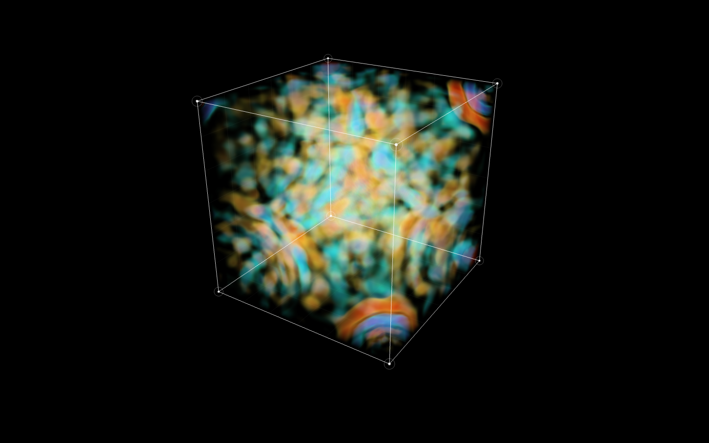

# Physics of the cube

[한국어 README로 돌아가기](../README.ko.md) · [English README](../README.md)

Sound Code Cube의 공간은 음악의 성부를 여덟 파원에 대응시킨 **감쇠 스칼라 압력장의 시각화**입니다. 구현은 [WaveField](../src/visual/wave-field.ts), 입력과 시간 진행은 [WaveCube](../src/visual/WaveCube.ts), 부피 표현은 [PressureVolume](../src/visual/PressureVolume.ts)에 있습니다.

## 모델

호이겐스 원리는 각 파면의 점이 다음 파면의 이차 파원이 된다는 전파의 관점을 제공합니다. 큐브의 여덟 꼭짓점은 악기별 외부 입력을 가하는 **일차 파원**입니다. 이 둘은 구분됩니다. 구현에서 구면을 끝없이 복제하는 대신 격자 위 파동방정식을 계산합니다.

$$
\partial_t^2 p + \gamma\partial_t p = c^2\nabla^2p + s(\mathbf{x},t)
$$

| 기호 | 의미 | 기본값 |
| --- | --- | --- |
| $p$ | 상대 압력 | 격자에서 계산 |
| $s$ | 음악에서 유도한 파원 입력 | 성부별 파형·음표 발생 |
| $c$ | 시각적 공간의 전파 속도 | 1.45 단위/초 |
| $\gamma$ | 감쇠 계수 | 0.42 |
| $L$ | 한 변의 시각적 길이 | 3 단위 |
| $N$ | 한 축의 격자점 수 | 33 |
| $\Delta x$ | 격자 간격 | 3/32 단위 |
| $\Delta t$ | 한 계산 단계 | 1/90초 |

기본 설정은 35,937개 격자점을 사용합니다. 여섯 이웃의 값을 사용하는 공간 차분과 중앙 시간 차분으로 업데이트합니다. 외부 입력이 없는 한 단계의 식은 다음과 같습니다.

$$
p_{i,j,k}^{n+1}=
\frac{2p_{i,j,k}^{n}-(1-a)p_{i,j,k}^{n-1}
+\lambda^2\left(\sum_{q\in\mathcal{N}}p_q^n-6p_{i,j,k}^{n}\right)}{1+a},
\qquad a=\frac{\gamma\Delta t}{2},\quad
\lambda=\frac{c\Delta t}{\Delta x}
$$

음악 입력은 계산 단계에 맞춰 꼭짓점 격자에 교란을 더합니다. 생성자는 $\lambda\leq1/\sqrt{3}$인 3차원 CFL 조건을 검사합니다. 기본값의 $\lambda$는 약 0.172입니다. 이 모델에서 소리는 시각적으로 관찰할 수 있는 속도로 퍼집니다.

## 경계와 중첩

여섯 면에서 법선 방향 압력 기울기를 0으로 두는 Neumann 조건을 사용합니다. 격자 밖의 값을 경계 셀로 대체하여 반사 경계를 근사합니다. 실제 방의 벽 재질별 흡음률이나 주파수 의존 반사율은 모델링하지 않습니다.

같은 격자 안에서 모든 파원의 압력을 더하므로 보강과 상쇄가 발생합니다. 두 파동은 서로를 튕겨 내거나 진로를 바꾸지 않습니다. 선형 파동은 서로 통과하고, 겹치는 위치에서 합성 압력이 달라집니다. 반사는 경계면에서 발생합니다.

꼭짓점 번호는 `x + 2y + 4z`이고 각 비트가 축의 음·양 방향을 구분합니다. 순서대로 킥, 베이스, 스네어, 하이햇, 퍼커션, 코드, 멜로디, 텍스처를 배치합니다. 각 파원은 해당 성부의 분석 파형과 음표 발생 시각으로 구동됩니다.

## 압력을 색으로 읽기

렌더러는 압력장의 평균을 빼서 균일한 DC 성분을 제거하고 RMS 크기로 정규화합니다. 이 상대 압력장을 half-float 3D 텍스처로 GPU에 전달합니다. 셀 사이는 삼선형 보간으로 이어집니다.

시선이 큐브를 통과하는 구간을 따라 여러 지점을 샘플링합니다. 압력의 부호와 크기는 팔레트 위치를, 절댓값은 표시 밀도를 정합니다. 각 샘플의 불투명도는 다음과 같이 계산하여 앞에서 뒤로 합성합니다.

$$
\alpha = 1-\exp(-\kappa\rho\Delta \ell)
$$

이 Beer–Lambert 형태는 레이 샘플 간격에 따라 투명도가 크게 바뀌지 않도록 합니다. 여기의 밀도와 빛의 감쇠는 **압력장을 읽기 위한 렌더링 규칙**이며, 실제 공기가 그 색으로 빛난다는 물리적 주장이 아닙니다. 선형 압력이 상쇄된 뒤 밀도를 계산하므로 서로 다른 색의 표면을 단순히 포개는 것과도 다릅니다.

사용자는 Turbo, Plasma, Viridis, Icefire, Spectral 팔레트와 그중 사용할 색 구간, 진폭 감도를 선택합니다. 장르별 색조 변화와 전환 파면은 압력 계산 위에 더해지는 표현입니다. 파원별로 하나의 고정 색을 붙이는 방식은 아닙니다.

## 무엇을 측정하는가

이 장면은 **같은 악보에서 유도한 상대 압력의 수치적 유비**입니다. 방의 실제 미터 크기, 가청 주파수 전체, 음속, 데시벨, 청취자의 HRTF를 재현하지 않습니다. 33³ 해상도의 격자는 미세한 파장을 충실하게 재현하는 정밀 음향 해석에 적합하지 않습니다.

네이티브 모드의 소리는 TidalCycles와 SuperDirt가 만들고, 시각화 입력은 브라우저가 같은 악보를 연주하는 무음 분석 경로에서 얻습니다. SuperCollider 출력을 직접 캡처한 값이 아니므로 신스의 세부 파형이나 오디오 장치의 지연까지 일치하지는 않습니다. 큐브 회전은 보기 방향을 바꾸며 실제 스테레오 출력의 청취 위치나 방 형상을 바꾸지 않습니다.

## 출발점과 검증

발상의 출발점은 [Royo 등의 mitransient 논문](https://arxiv.org/abs/2510.25660), 전파의 해석적 배경은 [호이겐스 원리](https://openstax.org/books/university-physics-volume-3/pages/1-6-huygenss-principle)입니다. 광학 렌더러의 코드를 사용하거나 동일한 빛 수송 모델을 구현하지는 않았습니다.

프로젝트 테스트는 교란이 원인보다 먼저 퍼지지 않는지, 파원 합성이 선형성을 보존하는지, 반대 위상의 입력이 상쇄되는지, 경계에서 반사가 생기는지, 긴 실행에서 수치적으로 안정적인지를 확인합니다.
